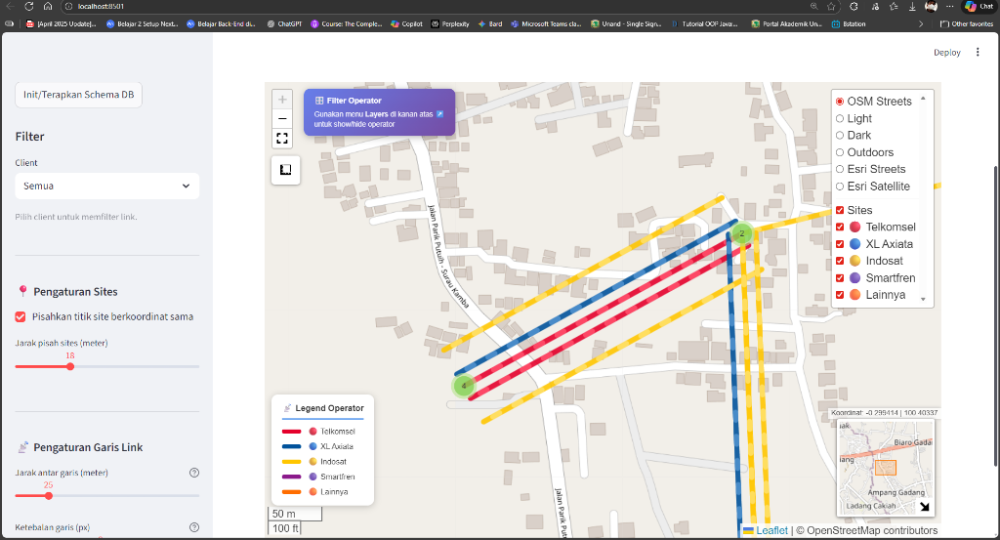
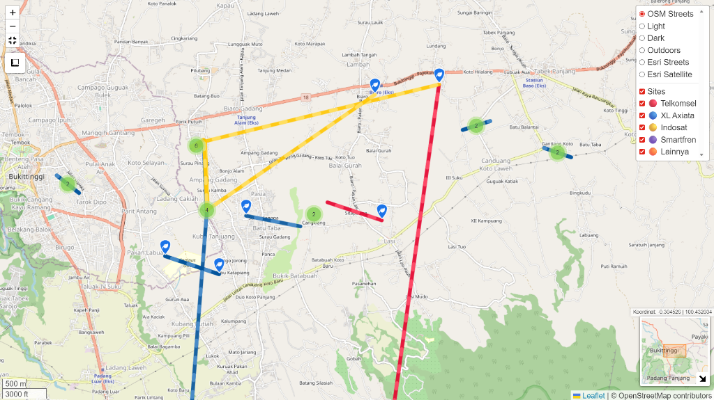

# 📡 Satelit Links App

Aplikasi visualisasi dan manajemen data link satelit berbasis **Streamlit** dengan database **PostgreSQL**.


## ✨ Fitur Utama

### 🗺️ Peta Interaktif
- Visualisasi lokasi site dan link satelit pada peta
- Layer control untuk filter berdasarkan operator
- Marker clustering untuk site yang berdekatan
- Garis link dengan pewarnaan per operator

### 📊 Manajemen Data
- **Clients**: CRUD data operator/klien
- **Sites**: CRUD data lokasi dengan koordinat GPS
- **Links**: CRUD data koneksi antar site

### 📥 Import Data CSV
- Upload file CSV untuk import data secara bulk
- Preview data sebelum import
- Validasi kolom otomatis
- Skip duplikat untuk menghindari data ganda

### ⚙️ Pengaturan Visualisasi
- Jarak pisah sites yang berkoordinat sama
- Jarak antar garis link yang overlapping
- Ketebalan garis link

## 🛠️ Tech Stack

| Komponen | Teknologi |
|----------|-----------|
| Frontend | Streamlit |
| Backend | Python |
| Database | PostgreSQL |
| Peta | Folium |
| Data Processing | Pandas |

## 📋 Prasyarat

- Python 3.8+
- PostgreSQL 13+
- pip (Python package manager)

## 🚀 Instalasi

### 1. Clone Repository

```bash
git clone https://github.com/cikinodapz/satelit-links.git
cd satelit-links
```

### 2. Buat Virtual Environment

```bash
python -m venv venv

# Windows
venv\Scripts\activate

# Linux/Mac
source venv/bin/activate
```

### 3. Install Dependencies

```bash
pip install -r requirements.txt
```

### 4. Konfigurasi Database

Buat file `.streamlit/secrets.toml`:

```toml
[postgres]
host = "localhost"
port = 5432
dbname = "satelit"
user = "postgres"
password = "your_password"
```

Atau gunakan environment variables:
- `PGHOST`
- `PGPORT`
- `PGDATABASE`
- `PGUSER`
- `PGPASSWORD`

### 5. Jalankan Aplikasi

```bash
streamlit run app.py
```

Aplikasi akan terbuka di browser pada `http://localhost:8501`

## 📁 Struktur Database

```sql
-- Tabel Clients
CREATE TABLE clients (
    client_id SERIAL PRIMARY KEY,
    client_name VARCHAR(100) NOT NULL
);

-- Tabel Sites
CREATE TABLE sites (
    site_id VARCHAR(50) PRIMARY KEY,
    site_name VARCHAR(150),
    site_address TEXT,
    lat_dec DOUBLE PRECISION,
    long_dec DOUBLE PRECISION
);

-- Tabel Links
CREATE TABLE links (
    link_id SERIAL PRIMARY KEY,
    appl_id VARCHAR(50),
    client_id INT REFERENCES clients(client_id),
    site_from VARCHAR(50) REFERENCES sites(site_id),
    site_to VARCHAR(50) REFERENCES sites(site_id),
    freq INT,
    freq_pair INT,
    bandwidth INT,
    model VARCHAR(100)
);
```

## 📥 Format CSV untuk Import

File CSV harus memiliki kolom berikut:

| Kolom | Deskripsi |
|-------|-----------|
| `CLNT_NAME` | Nama client/operator |
| `STN_NAME` | Nama site asal |
| `STN_ADDR` | Alamat site |
| `LAT_DEC` | Latitude (desimal) |
| `LONG_DEC` | Longitude (desimal) |
| `STASIUN_LAWAN` | Nama site tujuan |
| `TO_LAT_DEC` | Latitude tujuan |
| `TO_LONG_DEC` | Longitude tujuan |
| `APPL_ID` | Application ID |
| `FREQ` | Frekuensi (MHz) |
| `FREQ_PAIR` | Frekuensi pair (MHz) |
| `BWIDTH` | Bandwidth (kHz) |
| `EQ_MDL` | Model perangkat |

Contoh file tersedia: `dummies.csv`

## 📸 Screenshots

### Tampilan Aplikasi dengan Sidebar


### Peta Fullscreen dengan Link Satelit


## 🤝 Kontribusi

Kontribusi sangat diterima! Silakan buat Pull Request atau buka Issue untuk diskusi.

## 📄 Lisensi

Proyek ini dilisensikan di bawah [MIT License](LICENSE).

---

Made with ❤️ using Streamlit
